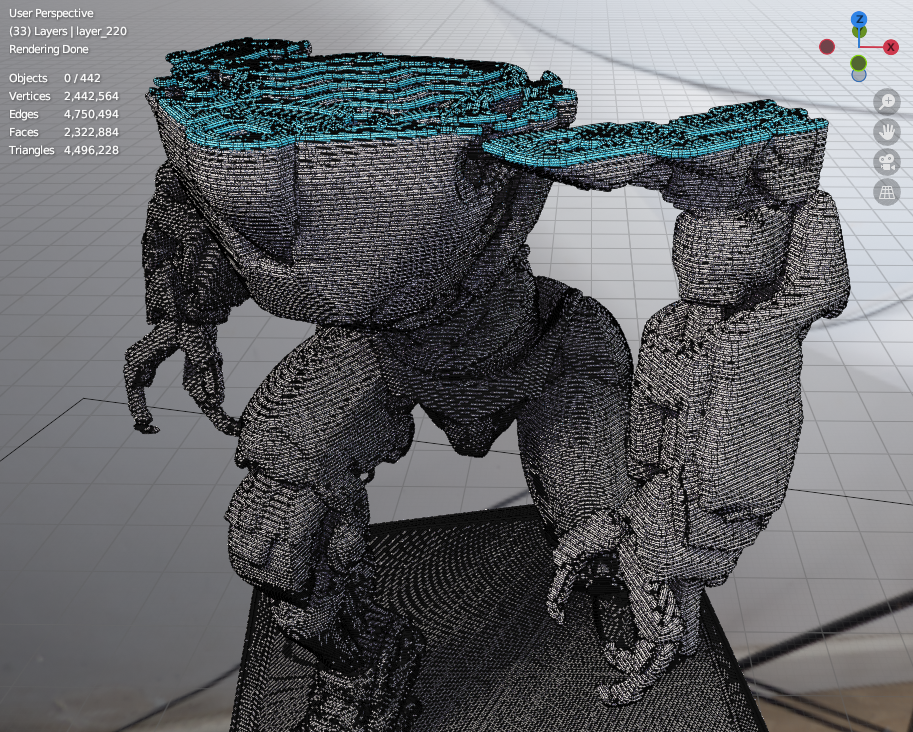
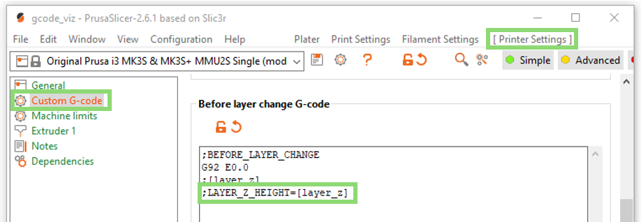
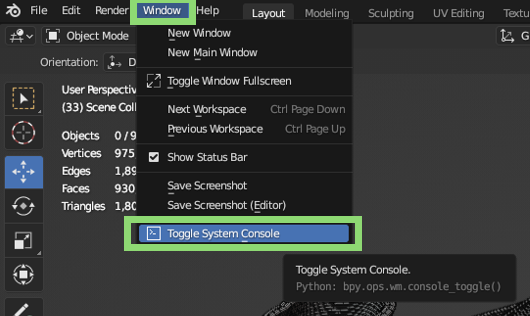
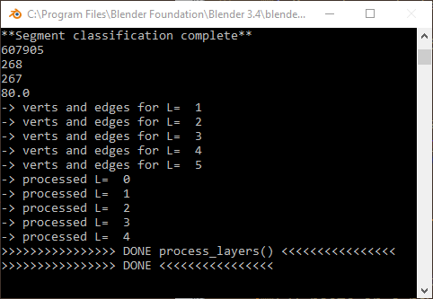

# G-code parsing and visualization in Blender

This repository contains scripts for Blender (checked with 3.4.1 version) that allow you to parse and visualize single-material `.gcode` files generated with [PrusaSlicer](https://www.prusa3d.com/en/page/prusaslicer_424/).

- Background: Motivated by Heinz Loepmeier's ["Blender G-Code Importer"](https://github.com/Heinz-Loepmeier/Blender-Gcode-Import).
- **For details, please refer to the [wiki](https://github.com/apetsiuk/GCode-Parser-and-Viz/wiki) page.**

| Render |  Viewport  |
| :---:   | :---: |
|  |   |

*\*Model: ["Cyberpunk Robots x6" by CharlieVet](https://www.thingiverse.com/thing:4092671)*

---

### PrusaSlicer setup

Put the `;LAYER_Z_HEIGHT=[layer_z]` line in the "Before layer change G-code" in PrusaSlicer.

### G-code parsing

| Parsed g-code layer |  Details  |
| :---:   | :---: |
|  |   |

### Setup Blender environment
You can manually set light sources, camera settings, background images, [HDRI maps](https://hdrmaps.com/freebies/), and materials. Alternatively, you can run certain scripts (***"scene_setup_scripts"*** folder) to automate some parts of this process.

### Run in Blender

To run it in Blender: (1) copy the code from the ***"blender_scripts"*** folder, (2) paste in a new script created in the "Scripting" tab, (3) update the "TODO" sections in the code, and (4) hit the "Run" button.

 

When you run a script, Blender becomes unresponsive. Therefore, switch the system console window to be able to “Ctrl+C” (break) processing in case of any errors.

| Toggle system console |  Console window  |
| :---:   | :---: |
|  |   |

 

### Add automatic animation
Uncomment the following functions in the script:

