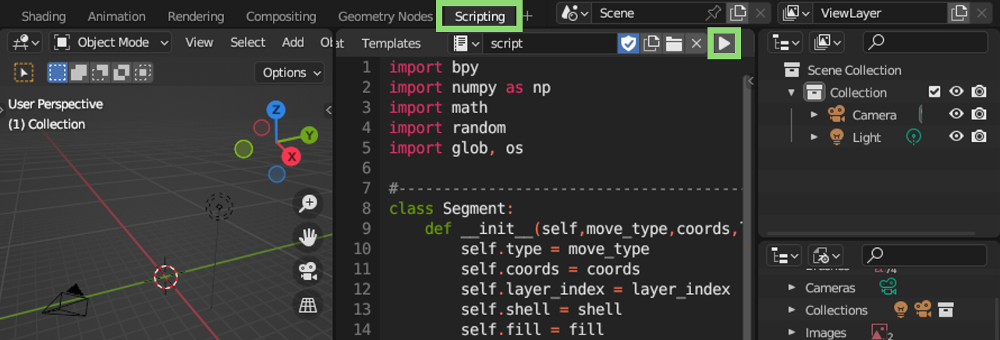

# G-code parsing and visualization in Blender

 

This repository contains scripts for Blender (checked with 3.4.1 version) that allow you to parse and visualize single-material `.gcode` files generated with [PrusaSlicer](https://www.prusa3d.com/en/page/prusaslicer_424/).

- Background: Based on Heinz Loepmeier's ["Blender G-Code Importer"](https://github.com/Heinz-Loepmeier/Blender-Gcode-Import).
- For details, please refer to the [wiki](https://github.com/apetsiuk/GCode-Parser-and-Viz/wiki) page.

### G-code parsing

### Setup Blender environment
You can manually set light sources, camera settings, background images, [HDRI maps](https://hdrmaps.com/freebies/), and materials. Alternatively, you can run certain scripts (***"scene_setup_scripts"*** folder) to automate some parts of this process.

### Run in Blender

To run it in Blender: (1) copy the code from the ***"blender_scripts"*** folder, (2) paste in a new script created in the "Scripting" tab, (3) update the "TODO" sections in the code, and (4) hit the "Run" button.

 

### Add automatic animation
Uncomment the following functions in the script:

