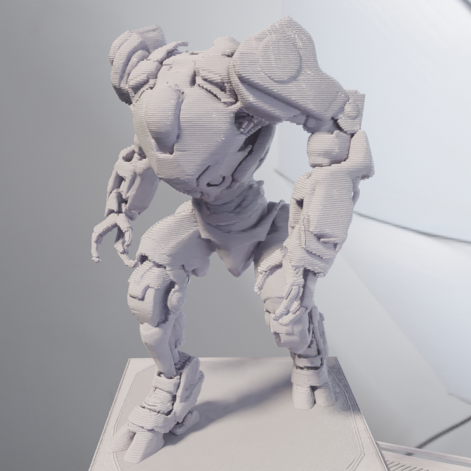
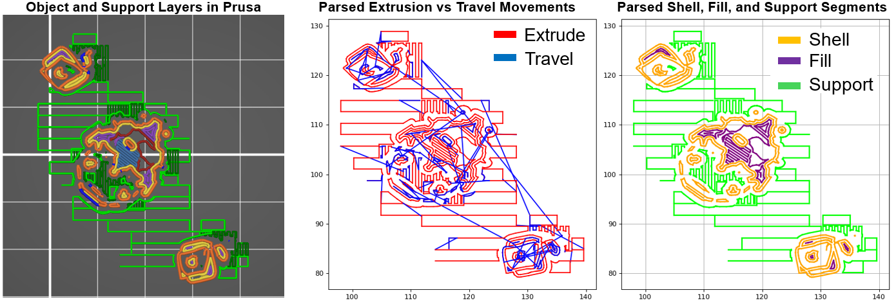
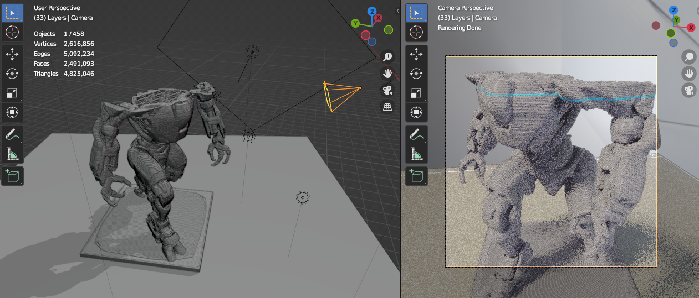

# G-code parsing and visualization in Blender

This repository contains scripts for Blender (checked with 3.4.1 version) that allow you to parse and visualize single-material `.gcode` files generated with [PrusaSlicer](https://www.prusa3d.com/en/page/prusaslicer_424/).

- Background: Motivated by Heinz Loepmeier's ["Blender G-Code Importer"](https://github.com/Heinz-Loepmeier/Blender-Gcode-Import).
- **For details, please refer to the [wiki](https://github.com/apetsiuk/GCode-Parser-and-Viz/wiki) page.**

| Render |  Viewport  |
| :---:   | :---: |
|  |   |

*\*Model: ["Cyberpunk Robots x6" by CharlieVet](https://www.thingiverse.com/thing:4092671)*

---

### PrusaSlicer setup

The sample g-code was created with PrusaSlicer-2.6.1. Put the `;LAYER_Z_HEIGHT=[layer_z]` line in the "Before layer change G-code" in PrusaSlicer.

### G-code parsing

PrusaSlicer 2.6.1 supports G-Code parser supports 12 types of nozzle movements:

- (1) Perimeter
- (2) External perimeter
- (3) Overhang perimeter
- (4) Internal infill
- (5) Solid infill
- (6) Top solid infill
- (7) Bridge infill
- (8) Support material
- (9) Support material interface
- (10) Skirt/Brim
- (11) Wipe tower
- (12) Custom

The developed parser combines all perimeters as **Shell**, all infills - as **Fill**, and all supports - as **Support**.

### Setup Blender environment
You can manually set light sources, camera settings, background images, [HDRI maps](https://hdrmaps.com/freebies/), and materials. Alternatively, you can run certain scripts (***"scene_setup_scripts"*** folder) to automate some parts of this process.

### Blender scene

The script-based scene genetator picks the local "print_bed.jpg" file and scales it to real 210x210 mm Prusa Printer dimensions.

### Run in Blender

To run it in Blender: (1) copy the code from the ***"blender_scripts"*** folder, (2) paste in a new script created in the "Scripting" tab, (3) update the "TODO" sections in the code, and (4) hit the "Run" button.

  

When you run a script, Blender becomes unresponsive. Therefore, switch the system console window to be able to “Ctrl+C” (break) processing in case of any errors.

| Toggle system console |  Console window  |
| :---:   | :---: |
|  |   |

 

### Add automatic animation

Uncomment the `animate_layers()` function in the script.

